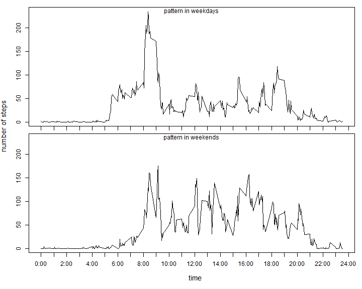

## Loading and preprocessing the data
Load the data.

```r
unzip("activity.zip")
data = read.csv("activity.csv")
```

And preview the data

```r
dim(data)
```

```
## [1] 17568     3
```

```r
head(data)
```

```
##   steps       date interval
## 1    NA 2012-10-01        0
## 2    NA 2012-10-01        5
## 3    NA 2012-10-01       10
## 4    NA 2012-10-01       15
## 5    NA 2012-10-01       20
## 6    NA 2012-10-01       25
```

## What is mean total number of steps taken per day?
Calculate steps per day, ignore NA values.

```r
steps.per.day = aggregate(data$steps, by=list(data$date),sum, na.rm=T)
colnames(steps.per.day) = c("date", "steps")
```

Do hist plot.

```r
hist(steps.per.day$steps, breaks=10)
```

 

Calculate mean and median

```r
c(mean=mean(steps.per.day$steps), median=median(steps.per.day$steps))
```

```
##     mean   median 
##  9354.23 10395.00
```

We can see that the mean/median steps per day is about 10,000.

## What is the average daily activity pattern?
Calcuate average steps on each interval

```r
steps.on.interval = aggregate(data$steps, by=list(data$interval), mean, na.rm=T)
colnames(steps.on.interval) = c('interval', 'steps')
```
Plot steps along time

```r
plot(steps.on.interval, type="l", xlab="time", ylab="average steps /5min", xaxt="n")
axis(1, at=0:24*100, labels= paste(0:24, ":00", sep=""))
```

 

We can see that there are several peaks on the plot, the highest is at 8~9 o'clock.
The 5minute with the most average steps is

```r
steps.on.interval[order(steps.on.interval$steps, decreasing=T)[1],]
```

```
##     interval    steps
## 104      835 206.1698
```


## Imputing missing values

The numbers of records with NAs are

```r
sum(!complete.cases(data))
```

```
## [1] 2304
```

We will fill these NAs with the mean steps on the time interval on average,
and generated a new dataset named data.fillna

```r
data.fillna = data
fill.data = setNames(steps.on.interval$steps, as.character(steps.on.interval$interval))
na.idx = is.na(data$steps)
data.fillna[na.idx, 'steps'] = fill.data[as.character(data[na.idx, 'interval'])]
head(data.fillna)
```

```
##       steps       date interval
## 1 1.7169811 2012-10-01        0
## 2 0.3396226 2012-10-01        5
## 3 0.1320755 2012-10-01       10
## 4 0.1509434 2012-10-01       15
## 5 0.0754717 2012-10-01       20
## 6 2.0943396 2012-10-01       25
```

Recalculate steps per day

```r
attach(data.fillna)
steps.per.day.fillna = aggregate(steps, by=list(date),sum, na.rm=T)
colnames(steps.per.day.fillna) = c("date", "steps")
hist(steps.per.day.fillna$steps, breaks=10)
```

 

```r
c(mean=mean(steps.per.day.fillna$steps), 
  median=median(steps.per.day.fillna$steps))
```

```
##     mean   median 
## 10766.19 10766.19
```

```r
detach(data.fillna)
```

After filling the missing data, we can see the peak of the histgram is more sharp,
and the days with very small step numbers is decreased. These small step numbers 
may induced by missing of data. Filling the missing data also makes the mean and
median of daily steps become larger, as expected.


## Are there differences in activity patterns between weekdays and weekends?

Get patterns on weekdays and weekends, respectively.

```r
is.weekends = weekdays(as.Date(data$date)) %in% c("Saturday", "Sunday")
pattern.weekdays = aggregate(data[!is.weekends,]$steps, 
                             by=list(data[!is.weekends,]$interval), mean, na.rm=T)
pattern.weekends = aggregate(data[is.weekends,]$steps, 
                             by=list(data[is.weekends,]$interval), mean, na.rm=T)
```

Plot and compare the pattern.

```r
# align y axis
ylim = c(0, max(pattern.weekdays$x, pattern.weekends$x))
par(mfrow=c(2,1), oma=c(5,4,0,0), mar=c(0,0,1,1))
plot(pattern.weekdays, type="l", ylim=ylim, xlab="", ylab="", xaxt="n")
axis(1, at=0:24*100, labels= F)
mtext("pattern in weekdays", 3, -1)
plot(pattern.weekends, type="l", ylim=ylim, xlab="", ylab="", xaxt="n")
mtext("pattern in weekends", 3, -1)
axis(1, at=0:24*100, labels= paste(0:24, ":00", sep=""))
title(xlab="time", ylab="number of steps", outer=T, cex.lab=1.2)
```

 

The steps pattern in weekdays have a peak at the morning, and then the activity 
reduced to a relatively low level along the daytime. While in weeks the steps keeps
on a relatively high level along the daytime. On weekends people have their own time
and may walk or do same movements on their own schedule, which could leads to the
different patterns between weekdays and weekends.


